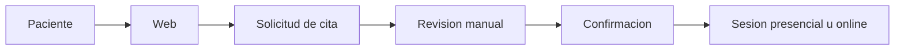

# Psicologia Montaner


Pagina web estatica para una consulta de psicologia.

## Vista general



## Estructura

```text
.
|-- index.html
|-- styles.css
|-- app.js
|-- markdown/
`-- README.md
```

## Ejecutar en local

```bash
python3 -m http.server 5500 --bind 0.0.0.0
```

Abrir:

```text
http://localhost:5500/
```

Desde otros equipos de la misma red, usar la IP del ordenador:

```text
http://IP_DEL_EQUIPO:5500/
```
