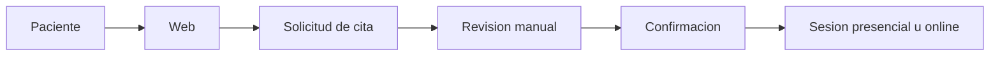

# Psicologia Montaner


Pagina web estatica para una consulta de psicologia.

## Vista general



## Estructura

```text
.
|-- index.html
|-- styles.css
|-- app.js
|-- markdowns/
|-- .github/workflows/pages.yml
`-- README.md
```

## Despliegues

El workflow de GitHub Actions publica todo en la rama `gh-pages`:

| Rama o evento | Destino | URL esperada |
| --- | --- | --- |
| `main` | Produccion | `https://kenta2097.github.io/psy-page/` |
| `develop` | Preview/Dev | `https://kenta2097.github.io/psy-page/dev/` |
| Pull request | Preview automatico | `https://kenta2097.github.io/psy-page/pr/pr-<numero>/` |

Configurar GitHub Pages en `Settings > Pages` con:

| Opcion | Valor |
| --- | --- |
| Source | Deploy from a branch |
| Branch | `gh-pages` |
| Folder | `/ (root)` |

Si `gh-pages` todavia no aparece, hacer primero un push a `main` para que el workflow cree la rama. El repositorio tambien debe permitir `Read and write permissions` en `Settings > Actions > General > Workflow permissions`.

Para activar la rama de desarrollo:

```bash
git checkout main
git pull
git checkout -b develop
git push -u origin develop
```

## Proteccion de `main`

Configurar `Settings > Branches > Add branch protection rule`:

| Ajuste | Valor recomendado |
| --- | --- |
| Branch name pattern | `main` |
| Require a pull request before merging | Activado |
| Require status checks to pass before merging | Activado |
| Required checks | `Build static site` |
| Require branches to be up to date before merging | Activado |
| Require conversation resolution before merging | Activado |
| Do not allow bypassing the above settings | Activado si el equipo lo necesita |
| Allow force pushes | Desactivado |
| Allow deletions | Desactivado |

Si `main` ya esta protegida, anadir `Build static site` como required check despues de que el workflow se ejecute al menos una vez.

## Ejecutar en local

```bash
python3 -m http.server 5500 --bind 0.0.0.0
```

Abrir:

```text
http://localhost:5500/
```

Desde otros equipos de la misma red, usar la IP del ordenador:

```text
http://IP_DEL_EQUIPO:5500/
```
